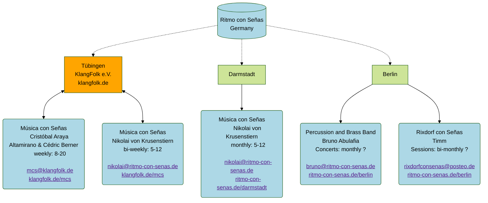
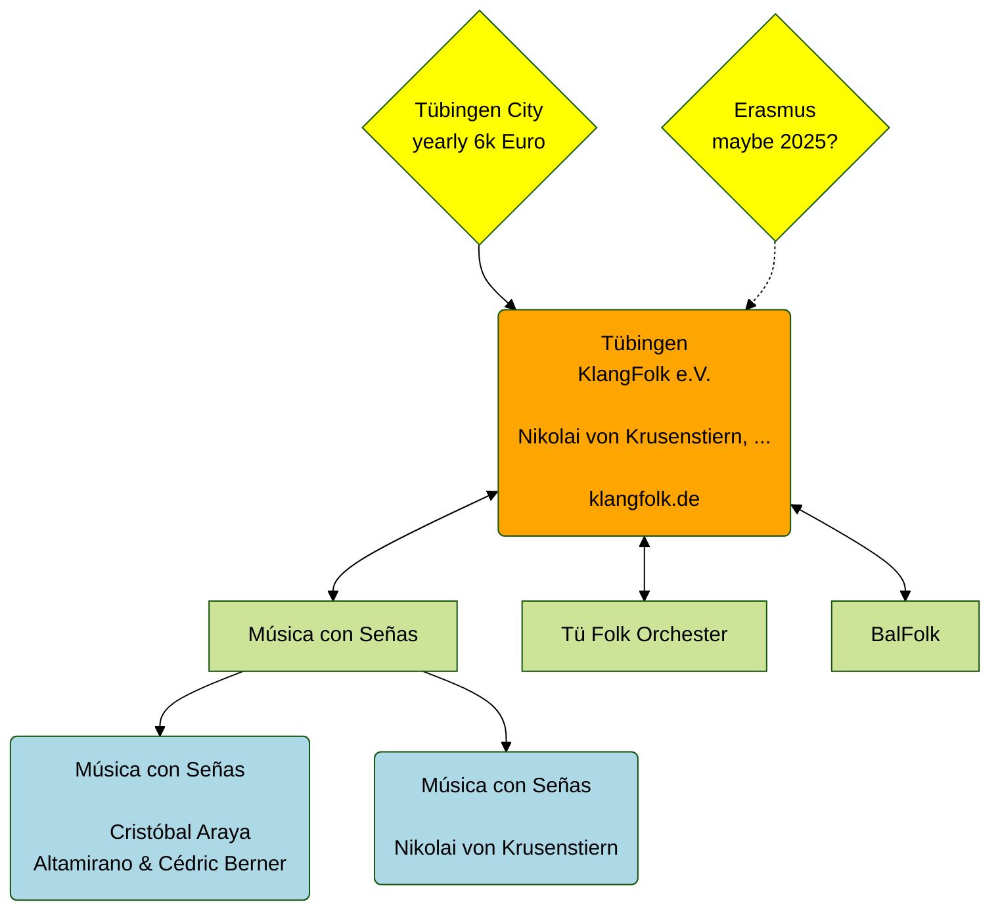

# Ritmo con Señas - Germany - Org-Charts

## Germany - Org-Charts

```mermaid
%%{init: {'theme':'forest'}}%%
flowchart TD
    rcs[(Ritmo con Señas<br>Germany)]
    TUE[Tübingen<br>KlangFolk e.V.<br>klangfolk.de]
    DA[Darmstadt]
    B[Berlin]

    rcs -.-> TUE
    rcs -.-> DA
    rcs -.-> B

    TUE_MCS(Música con Señas
        Cristóbal Araya Altamirano & Cédric Berner
        weekly: 8-20<br>
        <a href>mcs@klangfolk.de</a>
        <a href>klangfolk.de/mcs</a>)

    TUE_MCS_2(Música con Señas
        Nikolai von Krusenstiern
        bi-weekly: 5-12<br>
        <a href>nikolai@ritmo-con-senas.de</a>
        <a href>klangfolk.de/mcs</a>)
    
    TUE <--> TUE_MCS
    TUE <--> TUE_MCS_2

    DA_MCS(Música con Señas
        Nikolai von Krusenstiern
        monthly: 5-12<br>
        <a href>nikolai@ritmo-con-senas.de</a>
        <a href>ritmo-con-senas.de/darmstadt</a>)

    DA --> DA_MCS

    B_P(Percussion and Brass Band
        Bruno Abulafia
        Concerts: monthly ?<br>
        <a href>bruno@ritmo-con-senas.de</a>
        <a href>ritmo-con-senas.de/berlin</a>)

    B_R(Rixdorf con Señas
        Timm
        Sessions: bi-monthly ?<br>
        <a href>rixdorfconsenas@posteo.de</a>
        <a href>ritmo-con-senas.de/berlin</a>)
    B --> B_P
    B --> B_R

%%    linkStyle 11 stroke-width:4px,stroke:blue

    classDef BLUE fill:lightblue
    classDef YEL fill:yellow
    classDef BLU fill:skyblue
    classDef ORA fill:orange

    class rcs,TUE_MCS,TUE_MCS_2,DA_MCS,B_P,B_R BLUE
    class x BLU
    class x YEL
    class TUE ORA

```

## KlangFolk e.V.

```mermaid
%%{init: {'theme':'forest'}}%%
flowchart TD
    E{Erasmus
        maybe 2025?}
    TUE{Tübingen City
        yearly 6k Euro}
    
    KF(Tübingen<br>KlangFolk e.V.<br>
    Nikolai von Krusenstiern, ...<br>
    klangfolk.de)

    TUE --> KF
    E -.-> KF

    MCS[Música con Señas]
    TF[Tü Folk Orchester]
    BF[BalFolk]

    KF <--> MCS
    KF <--> TF
    KF <--> BF

    MCS_1(Música con Señas<br>
        Cristóbal Araya Altamirano & Cédric Berner)

    MCS_2(Música con Señas<br>
        Nikolai von Krusenstiern)    
    
    MCS --> MCS_1
    MCS --> MCS_2

%%    linkStyle 11 stroke-width:4px,stroke:blue

    classDef BLUE fill:lightblue
    classDef YEL fill:yellow
    classDef BLU fill:skyblue
    classDef ORA fill:orange

    class rcs,MCS_1,MCS_2,DA_MCS,B_P,B_R BLUE
    class x BLU
    class E,TUE YEL
    class KF ORA
```

(c) 2024 Nikolai von Krusenstiern
