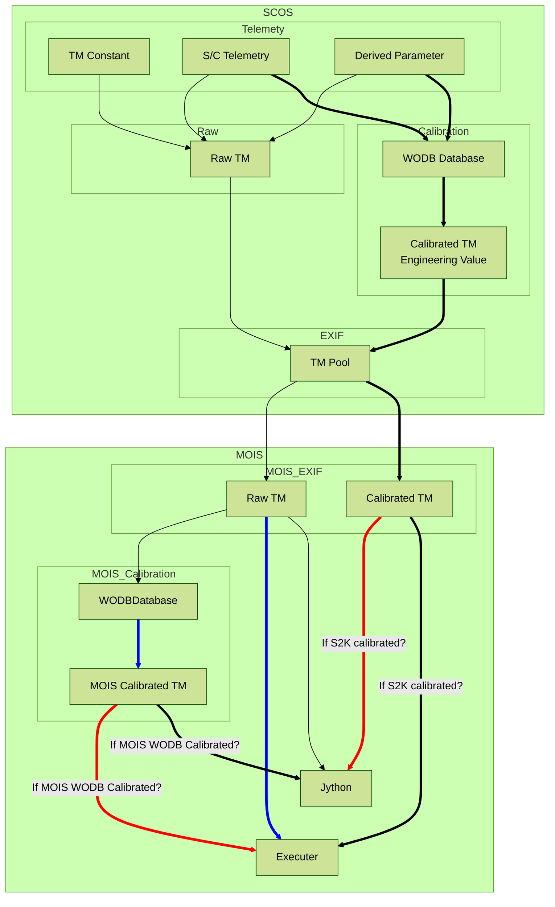

# Ritmo con Señas - Germany - Org-Charts

```mermaid
%%{init: {'theme':'forest'}}%%
flowchart TD
    subgraph SCOS
        subgraph Telemety
            TMC[TM Constant]
            TM[S/C Telemetry]
            DP[Derived Parameter]
        end
        subgraph Calibration
            WODB[WODB Database]
            CTM[Calibrated TM<br>Engineering Value]
        end
        subgraph Raw
            RAW[Raw TM]
        end

        subgraph EXIF
            TMP[TM Pool]
        end
    end

    subgraph MOIS
        subgraph MOIS_EXIF
            MTM[Raw TM]
            MCTM[Calibrated TM]
        end
        subgraph MOIS_Calibration
            MWODB[WODBDatabase]
            MCTM2[MOIS Calibrated TM]
        end
        EX[Executer]
        J[Jython]
    end

    TMC --> RAW
    TM --> RAW
    DP --> RAW
    TM ==> WODB
    DP ==> WODB
    WODB ==> CTM

    RAW --> TMP
    CTM ==> TMP

    TMP --> MTM
    TMP ==> MCTM
    MTM --> MWODB
    MWODB ==> MCTM2

    MTM --> EX
    MCTM ==> |If S2K calibrated?| J
    MCTM ==> |If S2K calibrated?| EX
    MCTM2 ===> |If MOIS WODB Calibrated?| EX

    MTM --> J
    MCTM2 ==> |If MOIS WODB Calibrated?| J

    linkStyle 11 stroke-width:4px,stroke:blue
    linkStyle 12 stroke-width:4px,stroke:blue

    linkStyle 13 stroke-width:4px,stroke:red
    linkStyle 15 stroke-width:4px,stroke:red

    classDef BLUE fill:lightblue
    classDef YEL fill:yellow
    classDef BLU fill:skyblue
    classDef ORA fill:orange

    class x BLUE
    class x BLU
    class x YEL
    class x ORA

```

(c) 2024 Nikolai von Krusenstiern
